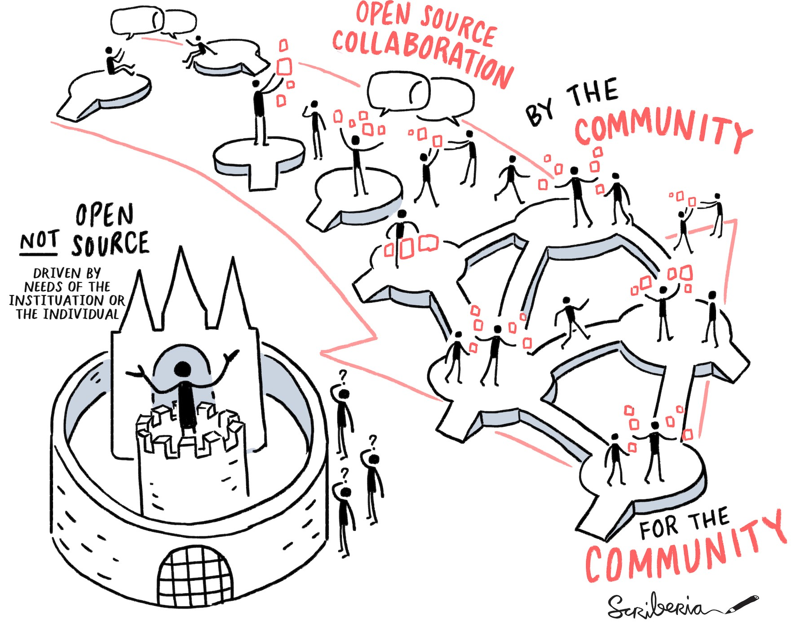
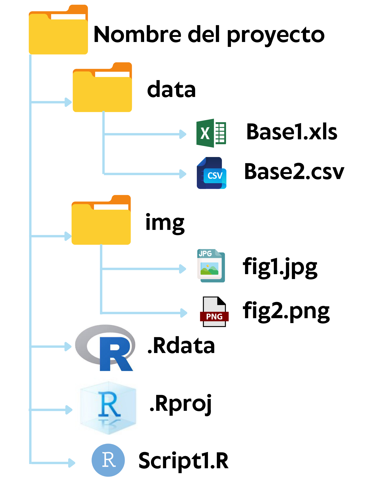

```{r configuracion, include = FALSE}
library(knitr)
library(tidyverse)
library(fontawesome)       #viñetas
library(xaringanExtra)
# set default options
opts_chunk$set(echo=FALSE,
               warning=FALSE,
               collapse = TRUE,
               dpi = 200)
knit_engines$set("yaml", "markdown")

xaringanExtra::use_tile_view()
xaringanExtra::use_clipboard()
xaringanExtra::use_share_again()
xaringanExtra::style_share_again(
  share_buttons = c("twitter", "linkedin", "pocket")
)
```

class: center, middle, titular
background-size: contain


# **`r rmarkdown::metadata$subtitle`**
### `r rmarkdown::metadata$author`
#### `r rmarkdown::metadata$date`

---

# `r fontawesome::fa("box-open")` Contenido del módulo

- **Sección 1: Introducción a RStudio.** Instalación de R y RStudio, RStudio Cloud, Ayuda, Paquetes, Proyectos y Scripts.

- **Sección 2: Generalidades y tidyverse.** Generalidades, Proceso del _tidyverse_, Importar datos.

- **Sección 3: Estructuras de datos.** Vectores, Data.frames y Listas.

- **Sección 4: Tipos de datos.** Numéricos, Caracteres, Factores, Fecha y Hora.

- **Sección 5: Manipulación de datos.** Modificar el nombre de las variables, Seleccionar o descartar variables, Operador pipe `%>%`, Filtrar observaciones, Agregar o editar variables, Resumir información, Agrupar o segmentar datos. _**Adicional: Datos relacionales y Datos ordenados.**_


---

# `r fontawesome::fa("box-open")` Contenido del módulo

- **Sección 6: Gráficos con `ggplot2`.** Gramática de gráficos, Datos, Estética, Geometría, Facetas, Transformaciones Estadísticas, Coordenadas, Escalas y Temas.

- **Sección 7: Análisis exploratorio de datos.** Histogramas, Gráfico de cajas, Gráfico de barras, Gráficos de dispersión, Varias variables numéricas con una categórica. _**Adicional: Gráfico de violín, Gráfico de pastel, Lollipop, Gráfico de cascada**_

- **Sección 8: Comunicando resultados en R.** Introducción a Rmarkdown, Notebooks para ejecutar directamente fragmentos de código de forma interactiva incluyendo gráficos y tablas, Diapositivas para presentaciones (HTML5, LaTeX Beamer o PowerPoint), Formatos de artículos de revistas y libros. _**Adicional: ¿Qué es GitHub?, Conectar RStudio y GitHub.**_

---

# `r fontawesome::fa("clock")` Horario del módulo

- Duración: Del 13 al 30 de marzo de 2023.

- Días: 13, 14, 15, 16, 22, 23, 29 y 30 de marzo de 2023.

| Hora     |  Contenido    |
|:--------:|:--------------|
| 19:00 a 20:10 | Bloque 1 |
| 20:10 a 20:20 | Receso  |
| 20:20 a 21:30 | Bloque 2 |


---

class: center, middle, titular
background-size: contain


# `r rmarkdown::metadata$title` 
## **`r rmarkdown::metadata$subtitle`**
#### `r rmarkdown::metadata$author`
#### `r rmarkdown::metadata$date`

---

class: middle, center, inverse

`r fontawesome::fa("r-project", height = "3em")`
# ¿Qué es R? y ¿Por qué R?

---

# `r fontawesome::fa("laptop-code")` ¿Qué es R?

Algunos datos importantes que debes conocer acerca de `r fontawesome::fa("r-project")`:

.pull-left[
* Fue desarrollado inicialmente por Robert Gentleman y Ross Ihaka del Departamento de Estadística de la Universidad de Auckland en 1993.

* Es un lenguaje de programación de análisis de datos. 

* Es un entorno de software libre y tiene licencia GNU GLP (Licencia Pública General de GNU).
]

.pull-right[
```{r investigacion, echo=FALSE, out.width='90%', fig.align='center'}

```
]

.footnote[[A Brief History R: Past and Future History](https://www.stat.auckland.ac.nz/~ihaka/downloads/Interface98.pdf)]

---

# `r fontawesome::fa("laptop-code")` ¿Por qué R?

.pull-left[
* Es uno de los lenguajes de programación más utilizados en investigación científica.

* Integra multitud de paquetes.

* Capacidad gráfica.

* GUI disponibles gratuitas para R, como [Rcmdr](https://www.youtube.com/watch?v=MPCjXq5-FJI) y [Rattle](https://www.youtube.com/watch?v=ARGfOHPVERc).

* Existen varias comunidades en el mundo para fomentar el avance del conocimiento y el uso del lenguaje de programación en R.
]

.pull-right[
```{r community, echo=FALSE, out.width='100%', fig.align='center'}
knitr::include_graphics("img/community.jpg")
```
]

.footnote[ [Top programming languages used in medical research](https://quantifyinghealth.com/programming-languages-popularity-in-research/) || [#30díasdegráficos](https://github.com/sporella/nightingale) || [The R community](https://blog.revolutionanalytics.com/2017/06/r-community.html)]

---

class: middle

.pull-left[

<br>
<br>
<br>
> *"Cuando comienzas a programar, es fácil sentirte realmente frustrado... Es solo una parte natural de la programación, le sucede a todos y se vuelve cada vez menos con el tiempo. No te culpes. Solo tómate un descanso, haz algo divertido y luego regresa e inténtalo de nuevo más tarde."*
> `r tufte::quote_footer('Hadley Wickham')`
]

.pull-right[

]

.footnote[[R for Data Science](https://es.r4ds.hadley.nz/)]

---

class: middle, center, inverse

`r fontawesome::fa("r-project", height = "3em")`
# R, RStudio y RStudio Cloud


---

background-image: url("img/IDE.png")
background-size: contain

---

# Instalación de R

Es necesario realizar la instalación en el mismo orden que se indica aquí, es decir instalar primero R y luego RStudio.

1. Para descargar R, ingresa a [CRAN](https://cran.rstudio.com/) y elige el sistema operativo de tu computadora. **CRAN** es un acrónimo *Comprehensive R Archive Network* (Red integral de archivos R) para el lenguaje de programación R.

2. Si tu sistema operativo es `Windows`, en la siguiente pantalla que te aparece elige la primera opción que indica `base`. Luego haz clic para iniciar la descarga del instalador de la última versión de R para Windows.

3. Si tu sistema operativo es `macOS`, elige la primera opción que indica `R-4.2.2-arm64.pkg` para iniciar la descarga del instalador.

4. Cuando se haya terminado de descargar el instalador, abre el ejecutable, elige el idioma español y sigue todos los pasos para su instalación dando clic en siguiente. Este proceso de instalación puede durar algunos minutos.

5. Cuando se haya completado la instalación, para confirmar que se hizo correctamente nos dirigimos a las aplicaciones y hacemos clic en `Inicio -> Todas las aplicaciones -> R -> R X64 4.2.0`.


---


# Instalación de RStudio

1. Con R instalado, ahora procederemos a descargar RStudio desde [https://posit.co/download/rstudio-desktop/](https://posit.co/download/rstudio-desktop/). 

2. Hacer clic en el ejecutable que se ha descargado e inicia la instalación siguiendo todos los pasos. Para confirmar que la instalación se hizo correctamente nos dirigimos a las aplicaciones y hacemos clic en `RStudio`.

<br>

# RStudio Cloud

La plataforma se encuentra en internet y no necesitamos instalar ningún IDE, ni ninguna herramienta como R. Fue liberada en el 2019 por RStudio.

1. Ingresar a [RStudio Cloud](https://rstudio.cloud/).

2. Crear una cuenta en RStudio Cloud.


---

background-image: url("img/rstudiocloud.jpg")
background-size: contain

---

class: middle, center, inverse

`r fontawesome::fa("r-project", height = "3em")`
# Entendiendo RStudio

---

# `r fontawesome::fa("laptop-code")` Entendiendo RStudio


```{r entorno, echo=FALSE, out.width='100%', fig.align='center', fig.cap="4 Paneles fundamentales de la Consola de RStudio"}
knitr::include_graphics("img/entorno.png")
```

---

.pull-left[
## `r fontawesome::fa("laptop-code")` **Consola**

* Se puede codificar directamente, pero no guardará el código. 

* Puedo ingresar operaciones matemáticas directamente:

```{r operacion, echo=TRUE}
8*4
```


* La función `getwd()` sirve para conocer el directorio en el que me encuentro actualmente

]

--

.pull-right[
## `r fontawesome::fa("laptop-code")` **Archivos de comandos** 

* Archivos de script, por ejemplo el archivo R. 

* Para ejecutar código:

   1. La línea de código fuente donde reside el cursor, presione `Ctrl+Enter` (o use el botón `Run`).
   2. Seleccione varias líneas a la vez y presione `Ctrl+Enter`.
   3. Todo el documento, presione `Ctrl+Shift+Enter` (o use el botón `Source`).

]

.footnote[[Editing and Executing Code in the RStudio IDE](https://support.rstudio.com/hc/en-us/articles/200484448-Editing-and-Executing-Code)]

---

.pull-left[
## `r fontawesome::fa("laptop-code")` **Archivos de comandos**

* Puede comentar y descomentar mediante el elemento de menú `Código -> Comentar/Descommentar líneas` o presiones `Comando+Mayús+C` o escribiendo el signo numeral.

```{r hola, echo=TRUE}
# use print para imprimir un texto o resultado
print("mi nombre es Linda")
```

## `r fontawesome::fa("laptop-code")` **Entorno del espacio de trabajo**

* Incluye cualquier objeto definido por el usuario (vectores, matrices, marcos de datos, listas, funciones). 
]

--

.pull-right[

## `r fontawesome::fa("laptop-code")` **Pantallas varias**

* **Archivos:** Le permite ver qué archivos están disponibles en su directorio de trabajo. 

* **Gráficos:** Mostrará cualquier visualización que produzca su código. 

* **Paquetes:** Mostrará una lista de todos los paquetes descargados a su computadora y también los que están cargados. 

* **Ayuda:** Permite buscar temas sobre los que necesita ayuda y también mostrará las respuestas de ayuda.

]

---

class: middle, center, inverse

`r fontawesome::fa("info", height = "3em")`
# Obteniendo ayuda

---

.pull-left[
# `r fontawesome::fa("laptop-code")` Desde la consola

* `help.start()` proporciona enlaces de ayuda general.

* `help.search()` busca en el sistema de ayuda la documentación que coincida con un carácter dado debe introducir cadena de texto.

* `help()` proporciona detalles para una función específica instalada en tu pc

* `RSiteSearch()` busca la frase clave en manuales de ayuda y listas de correo archivadas en el sitio web de [R Project](http://search.r-project.org/)

```{r ayudagral3, echo=TRUE, eval=FALSE}
RSiteSearch("string")
```
]

--

.pull-right[
# `r fontawesome::fa("globe")` Desde la web

* `r fontawesome::fa("google")`[oogle](https://www.google.com/)

* `r fontawesome::fa("stack-overflow")` StackOverflow en [http://stackoverflow.com/](http://stackoverfl ow.com/questions/tagged/r)

* `r fontawesome::fa("stack-exchange")` Cross Validated en [http://stats.stackexchange.com/](http://stats.stackexchange.com/questions/tagged/r)

* R-seek en [http://rseek.org/](http://rseek.org/)

* R-bloggers en [http://www.r-bloggers.com/](http://www.r-bloggers.com/)
]

---

class: middle, center, inverse

`r fontawesome::fa("box-open", height = "3em")`
# Trabajando con paquetes

---

class: middle, center

# `r fontawesome::fa("box")` Packages

<br>

En R, la unidad fundamental del código compartible es el paquete. Un paquete agrupa código, datos, documentación y pruebas y proporciona un método fácil para compartir con otros.

---

# `r fontawesome::fa("cube")` Instalando Paquetes

.pull-left[
### 1. **Desde CRAN** 

Repositorio oficial compuesto de un conjunto de servidores web y ftp mantenidos por la comunidad R a lo largo de todo el mundo.

```{r paquetes1, echo=TRUE, eval=FALSE}
install.packages("tidyverse")
```

### 2. **Desde Bioconductor** 

Se trata de un repositorio específico para bioinformática. Puede revisar más información en [https://www.bioconductor.org/](https://www.bioconductor.org/)
]

.pull-right[
### 3. **Con `devtools`** 

```{r paquetes3, echo=TRUE, eval=FALSE}
install.packages("devtools")
devtools::install_github("hadley/babynames")
```

### 4. **Interfaz gráfica**

* Desde la barra de Herramientas, escogemos la opción `Tools -> Install packages...` 

* Desde el panel de *pantallas varias* en la pestaña de `Packages`
]

---

# `r fontawesome::fa("cubes")` Cargando Paquetes

Una vez que el paquete se descarga en su computadora, puede acceder a las funciones y recursos proporcionados mediante código:

```{r cargando, echo=TRUE, eval=FALSE}
# carga el paquete para usar en la sesión actual de R
library(tidyverse)

# usar una función particular dentro de un paquete sin cargar el paquete 
dplyr::filter()
```

También puede cargar los paquetes desde el panel de *pantallas varias* en la pestaña de `Packages`.

RStudio compiló una guía con algunos de los mejores paquetes para cargar, manipular, visualizar, analizar e informar datos, que la puedes encontrar en [https://support.rstudio.com/hc/en-us/articles/201057987-Quick-list-of-useful-R-packages](https://support.rstudio.com/hc/en-us/articles/201057987-Quick-list-of-useful-R-packages).


---

class: middle, center, inverse

`r fontawesome::fa("folder-tree", height = "3em")`
# Creando proyectos y scripts

---

.pull-left[

]

.pull-right[
# `r fontawesome::fa("folder")` Proyectos

* Carpetas que contienen los scripts, archivos desde donde se importan los datos y los archivos de proyecto como el .RData (contiene los objetos con los que se está trabajando) y .Rhistory (contiene el historial de comandos).

* Cada vez que se abre un proyecto existente, se abren las ventanas que se encontraban activas en ese proyecto.

* Para crear un proyecto seguimos los siguientes pasos: `Project -> New Project... -> New Directory -> Empty Project -> "Poner nombre al proyecto y elegir ruta" -> Create Project`
]

---

# `r fontawesome::fa("file-code")` Scripts

Los scripts son documentos de texto con la extensión de archivo `.R`, por ejemplo `mi_script.R`.

Estos archivos son iguales a cualquier documento de texto, pero R puede leer y ejecutar el código que contienen.

Puedo crear un script:

1. Utilizando la ruta `File -> New File -> R Script`.

2. Utilizando el atajo `Ctrl+Shift+N`.

No te olvides comentar tu script, para crear secciones utiliza `Ctrl+Shift+R`.


---


class: middle, center, inverse

<br>
<br>

# **¡FIN!**
## Introducción a RStudio

.pull-left[
.center[
### [@socecuest `r fontawesome::fa("facebook")`](https://www.facebook.com/socecuest)

### [@see_estadistica `r fontawesome::fa("instagram")`](https://www.instagram.com/see_estadistica/)
]]

.pull-right[
.center[
### [@see_estadistica `r fontawesome::fa("twitter")`](https://twitter.com/see_estadistica)

### [@sosecuest `r fontawesome::fa("telegram")`](https://t.me/sosecuest)
]]
